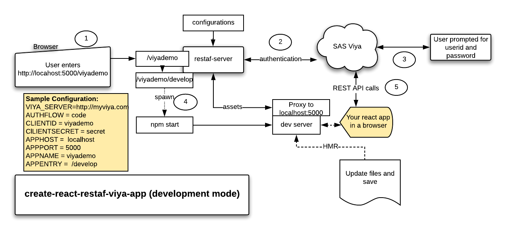

# create-react-restaf-viya-app

create-react-app from Facebook is a very popular cli for jump starting developing react apps.One of its key features is the Hot Module Replacement which recompiles and updates the display as the code is being updated.

Additionally when developing Viya apps the code needs to access SAS Viya using the REST APIs.

This extension of create-react-app is designed to help developer's building react apps using restaf library and its companions:

1. [restaf](https://github.com/sassoftware/restaf/wiki)
2. [restaflib](https://github.com/sassoftware/restaf/wiki)
3. [restaf-server](https://github.com/sassoftware/restaf-server/wiki)



>There is a fully functional demo in the demo directory of this repository. It uses material-ui as the primary UI framework.

## Key Assumption

The application is authenticated using authorization_code flow.

## App Creation

```sh
npx create-react-viya-app react-appname --webapp webapp-name  --title webapp-title --script scriptTags-file
```

Only the react-appname is required.
The optional parameters are:

- webapp  -- this is the user-friendly application name. Defaults to **viyademo**

- title   -- The text for the title tag in index.html. Defaults to **SAS/Viya Application**

- script  -- a file which has some HTML script tags to be inserted into index.html - defaults is a comment line

## Configuration

Set the following in the .env file:

- CLIENTID  -- the default value is viyademo
- CLIENTSECRET -- the default value is secret
- VIYA_SERVER  -- no defaults

Some defaults:

1. The app server runs on localhost:5000/viyademo
2. The clientid redirect is <http://localhost:5000/viyademo>
3. The create-react-app server runs on its standard port(3000)

For more detailed configuration ioptions see
See <https://github.com/sassoftware/restaf-server/wiki>

## Development mode

Run this command to have HMR enabled

```sh
cd to-the-app-directory
yarn dev
```

## Application mode

Run this command( no HMR)

```sh
cd to-the-app-directory
yarn app
```

Then use the created app just as you would any app created with create-react-app

## React Context - AppContext

By default a react context named AppContext is created.

To access the data code something like this:

```js

import React,{useContext} from 'react';
import AppContext from '../providers/AppContext';

let appContext = useContext(AppContext);

let {store, appOptions} = appContext;

let {appenv, logonPayload} = appOptions;

```

The store is the restaf store object that you will use to make the API calls.

## Requiring restaf and restaflib in your application

These two libraries are part of the installed dependencies. To access them in your react components do these as follows:

```js
let restaf = require('@sassoftware/restaf/dist/restaf.js');
let restaflib = require('@sassoftware/restaflib/dist/restaflib.js');
```

In all probablity you will not refer directly to restaf in your code. You will use the store object in the AppContext(see above). This value is set as part of the application setup.
